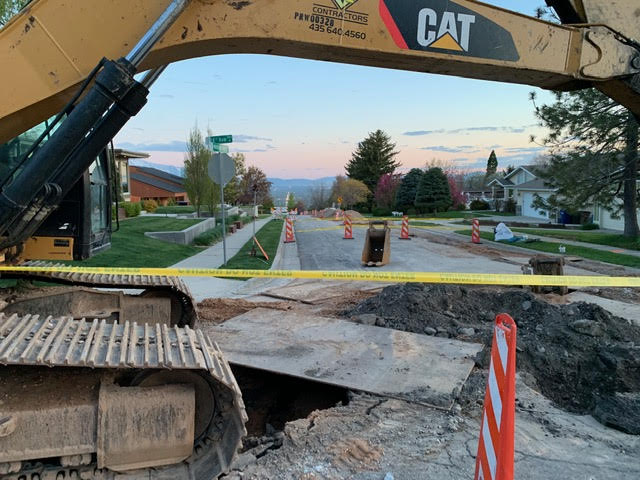
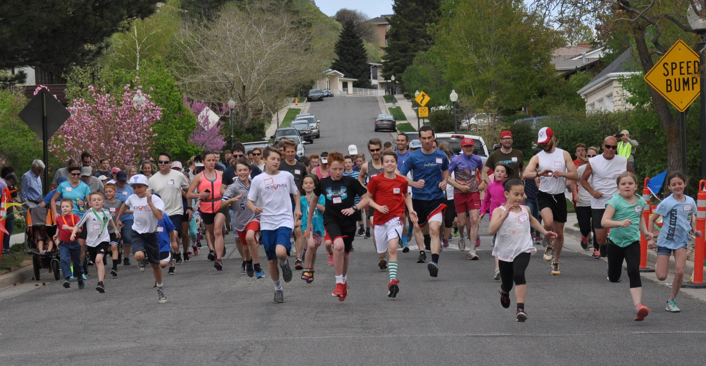
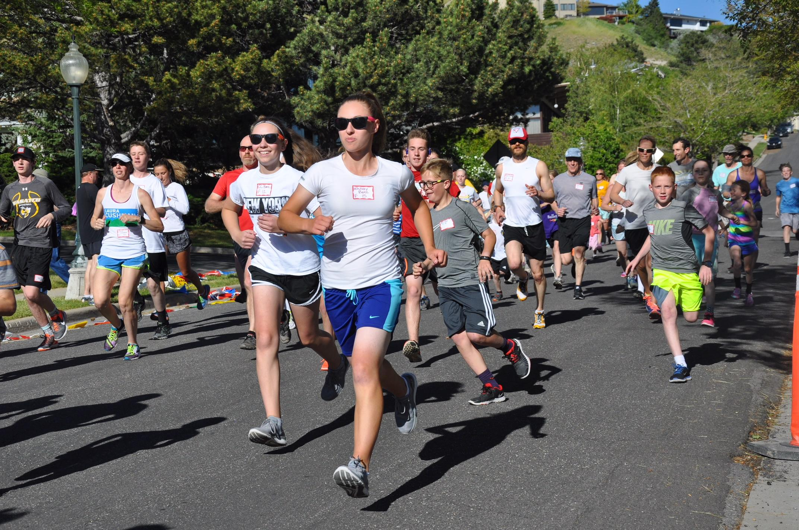
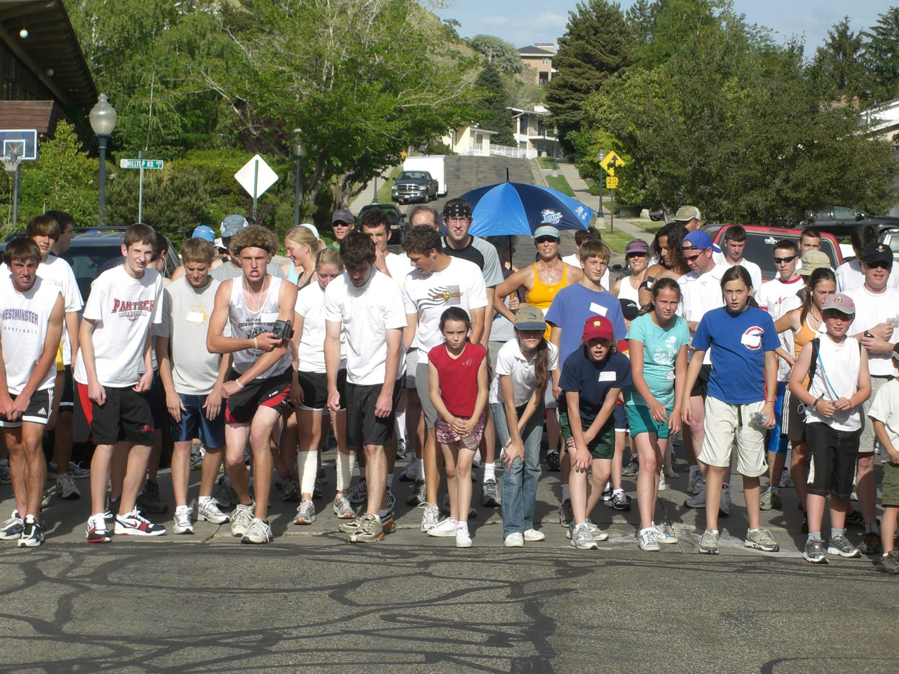
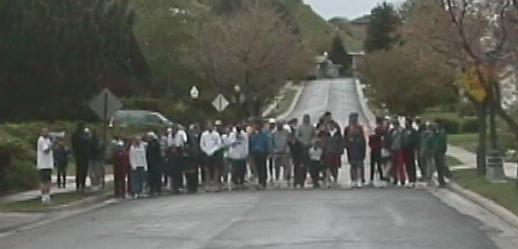

The idea of the High Fives 5K was first conceived by John Hansen while he was running along 11th Avenue in the fall of 2002. As a long time resident of the avenues, John was impressed by the fact that this neighborhood has many men, women and children who enjoy running. In contemplating creating a race for the High Aves, the idea was formed of a race that would be unique for the High Aves. The idea was to hold a FIVE-K race at FIVE thousand feet of altitude, and to start the race at 5:55pm on the FIFTH day of the 5th month. Hence, the name The High Fives 5K. Appropriately, the first sponsor of the High Fives 5K was the Ensign FIFTH Ward.

**2021** - The 2021 High Fives 5k & Kids Dash was an High Fives event unlike any other High Fives over the past 17 years! Because of the ongoing pandemic, in the Spring of 2020,  it was decided to postpone the High Fives until the summer. The event was eventually scheduled for Saturday July 17th, and the usual emails, posters and flyers were distributed announcing the 17th Annual High Fives races on that date.

But as July progressed the Salt Lake Valley began suffering from a serious heat spell. When he forecast for July 17th started projecting the temperature in the high 90s, concern was expressed that running the 5K at the hottest time of the day, on the hottest day of the year, was not a wise thing to do. The race organizers agreed that the traditional 5:55 pm race start time would not be appropriate this year. The decision was made a few days before the race to “BEAT THE HEAT” and run the High Fives races in the early morning, before the temperature became unbearably hot.  Many Race volunteers arrived at 5:30 am to set up for the race and the registration which began at 6 am.  The Kids Dash, for little children from 2 to 11 years old was set to begin at 6:35 am and the 5K race was scheduled to start at 6:55 am.  

Whether any young children would get up for a 6:35 am race on a saturday morning was a real question for the Kids Dash. Amazingly, fifteen undaunted youngest ventured to the starting line and ran the ⅕ mile race. The first finisher in the kids Dash was 9 yr old Adeline Wright, and her brother Ashewr Wright, a nine year old was the first male finisher.

The 5k Race had a field of 43 runners. The winner of this 5K was 15 year old Colin Patch. Collin is the youngest ever winner of the High Fives 5K, and he set  a new course record for the fastest 14 year old finish, a record which had not been broken since 2010.  Colin is has the course record for being the all time  5K winner who lives closest to the starting line. (Colin and his family live just around the corner from the start/finish line). Congratulation Conlin!

The female winner of the race was 19 year old Whitney Banz. Whitney is a familiar presence at the High Fives. Her course record (for running the fastest race in the female  10 and under division) which she set in 2008, still stands as a course record 13 years later. Whitney also get the distinction of winning the 5K race at the same time that she had a calling to serve as a missionary. Within a few weeks of winning the High Fives, Sister Whitney Banz was off, as a full time missionary in the enchanted country of Thailand.

Whitney was not the only runner in the 5K race. Two other runners, Elder  Jared Wright and Elder Nicholas Hardman were just beginning their mission training (both doing Home MTC in the homes in the avenues) received permission to run the 5k even while they were in mission training.

There were two course records broken in this race. As mentioned above, Conlin Patch broke the course record for the 14 yr old male division. The other new course record was set by Northcrest neighbor Stephen Clark. Stephen broke the course record for 60-69 year old males, a record which had stood since 2008. Congratulations Stephen!

**2020** - The High Fives 5k was scheduled to be held on April 25th 2020. However due to the Coronavirus Pandemic sadly the High Fives races were officially canceled. Although we couldn’t join together to hold this popular neighborhood activity this spring, still the spirit of the High Fives still burned strong in some of the great neighbors and friends of this 5k race.

Early in the morning of the canceled race,  Bob Edwards, an annual High Fives runner and course record holder in two divisions, went to the starting line of the 5k and completed a solo (and socially distanced) run of the 3.1 mile course.

That evening, at 5:55 pm John Hansen and his son Thomas Hansen lined up at the starting line for a two man run of the High Fives course. And later, Miles Petty, a past winner of the High Fives 5k, submitted his finish time for his solo run of the course.

So unofficially we had four finishers of the canceled 2020 High Fives 5k. Their runs will not show up as division and race winners, but their love of the race, and others disappointment over the cancellation of the race this year, helps us look forward to when we can all gather again for a true High Fives 5k and Kids Dash.

**2019** - One of the most concerning obstacle confronting the 2019 High Fives event was the major water piping replacement/road repair work which worked its way up Northcrest Drive and Hilltop Road all spring, and by the week of the Hogh Fives races had resulted in very large and deep trenches in the intersection of 18th Ave & Hilltop Road and continuing down to 16th Avenue. But Melanie Rogers talked to the City Road crew who promised to cover the trench in the intersection so we could run our races across these street. So when race day came, the runners were able to safely negotiate through or around these hazards without any injuries.

The road construction and hazards did not dampen the participation in this years 5K race, as 86 runners ran and finished this year’s 5K. That is the 3rd largest field of runners in the 16 years of running the 5K.

<figure style="padding: 25px; float: left;">

<figcaption style="text-align: center;">2019 Construction</figcaption>
</figure>

The winner of this year’s 5K was Tasha Mahmood, an Avenue’s resident who has taken second place in this race for the past two years. Congratulations Taha! On the women’s side, Adria Favero, the nine year old daughter of Kristen Monson Favero, became the youngest female ever to win this race. What an amazing accomplishment Adria! Great running ability is clearly in her family’s genetic code. Adria’s mother Kristen still holds the record for being the only 3 time Female Winner of the High Fives 5K. (Kristen was the Women’s 5K champion for the first three years of this 5K).

And while the field of runners in the 5K continues to get younger and younger each year, we want to also recognize the remarkable successes of our oldest runner in the 5K. At 81 years of age, Bob Edwards finished ahead of more than half of the runners in this race and once again won his age division (for the ninth straight time). congratulation Bob.

One other special feature of the 2019 High Fives was the Eagle Scout Project lead by Max Rogers in conjunction with the 22 Too Many foundation. Max Roger’s Eagle Project allowed for runners to run for military veterans who have suffered from the consequences of PTSD and other related mental health problems. Donations were made to the 22 Too Many foundation on behalf of these runners. Thank You Max for making the High Fives an especially significant event this year.

<figure style="padding: 25px; height: 360px; float: right;" >

<figcaption style="text-align: center;">2018 5K Start</figcaption>
</figure>
**2018** - This years High Fives Races once again had great neighborhood support and participation. An impressive number of runners in both the 5K and the Kids Dash. The 5K race had 78 finishers and the Kids Dash had 43 finishers. 

Two families who have been very supportive of the High Fives races made exceptional efforts to participate in this years races. First, former High Avenues residents Ben and Julie McAdams had a very legitimate reason for missing the event this year since Ben McAdams had been competing all day at the State Democratic Convention, seeking the nomination to the Unites States House of Representatives. But Ben and Julie and their family dashed from the State Convention to join us for the High Fives. And their 9 year old son Robert was the second finisher in the Kids Dash.

The McAdams family wasn’t the only family to go to great lengths to participate in their years High Fives events. Even though Dan and Laura Cushman’s family had just returned on a red eye flight from a Hawaii vacation only A few hours earlier that day, the family fought off the red eye fatigue and joined the competition. And Dan Cushman even won the race again. In fact he made High Fives History by becoming the first ever Four Time Champion of the 5k, winning it for the fourth year in a row.

The were no new course records set this year, but there was a first of a new kind- a new High Fives logo, and High Fives T-Shirts with the new logo. Thanks to Angela Krull for helping to design the new logo, and thanks to Melanie Rogers for connecting us with Scott and Offset Apparel for the great shirts and the cool design!

<figure style="padding: 25px; height: 360px; float: right;" >

<figcaption style="text-align: center;">2017 5K Start</figcaption>
</figure>

**2017** - The 14th Annual High Fives 5K enjoyed very pleasant weather conditions and another strong  field of runners along with family and neighborhood volunteers, supporters and spectators. A number of beloved former Avenues residents, such as the McMasters, Raynors, (Ben) Johnsons and the McAdams families, returned again to participate in this popular avenues neighborhood event.

Worth noting was the strong support and participation in the races by Avenues  connected political office holders and candidates, and their families. The families of Salt Lake County Mayor Ben McAdams and Salt Lake City Council candidate Laura Bushman added great support and involvement again this year. Salt Lake County Mayor Ben McAdams and his wife and children had strong performances in both the Kids Dash and the 5K. Ben and Julie’s  8 year old son Robert was the winner of the Kid’s Dash!

History was created in the 5K race this year when current Avenues resident Dan Cushman became the first “Three-Pete” male winner in the 14 year history of this event. Also,  Dan and his wife Laura Cushman became the first family to win both the men’s and the women’s divisions of the 5K, when Laura crossed the finish line as the first female finisher. Ryan Brown set a new course record in the 40-49 year old male division when he crossed the finish line in 20 minutes and 51 seconds. Congratulations to Ryan and all of the other participants and finishers in this years’ High Fives Races!

**2016** - Despite threatening rainstorms in the mid afternoon on Saturday May 7th,  the 13th Annual High Fives turned out to be another very successful and exciting neighborhood activity and it was record breaking in many ways.  Record numbers of participants competed in both the 5K and The Dash. There were 51 recorded finishers in the Dash and 105 finishers in the 5K!  36 year old Avenues resident Dan Cushman won the High Fives 5K for the second year in a row. Dan is the first High Five 5K  male repeat winner in over ten years. The female 5K winner was 18 year old Anna Boyes. The female winner of the Kid's Dash, for the 3rd year in a row, was 11 year old  Isabel Bestvina. The male winner of the Dash was 9 year old Joshua Schreiter.

This year's 5K also set new records for the youngest and oldest finishers. 4 year old Isaac McAdams became the youngest finisher of the 5K when he crossed the finish line with his father and others in the McAdams Clan. Barbara Anderson became the first finisher ever in the 80 plus division.

Congratulations to  Dan, Anna, Isabel, Joshua, Isaac, Barbara and everyone else, including the many neighborhood volunteers, who helped make this year's High Fives one of the best ever!

**2015** - The Amazing story of this year's high-fives 5K and Kids Dash was the fact that so many participants were undaunted in their excitement and determination to participate in the races despite unseasonable rainstorms which grippedthe Salt Lake Valley for much of the week  and then continued on race day from sunrise until sundown. On race morning the decision was made that race events would be held, rain or shine. When the rain continued to come down, literally all day long, it was expected that there would be a very minimal attendance and participation in the Kids Dash and the 5K. Shockingly, however, when the registration began in the church gymnasium before the race, the gym quickly filled up with young and old runners Who happily defied the weather and were determined to run in these races. Incredibly, 33 children ran in the Kid's dash  and 67 runners finished  the 5K race.

For the tenth consecutive year, the 5K race had a new male winner. This year's male winner was Dan Cushman. The female winner was Lindsey McSweeney, who has grown up running and swimming in the avenues. Our Young runners continue to be a stronger and more significant force in the High Fives 5K. This year 24 of the 67 5K finishers were 16 years old or younger. And of the first 13 finishers, six of them were 16 or younger.

**2014** - THE 11TH ANNUAL HIGH FIVES 5K AND KIDS DASH was another very successful neighborhood event.  We were threatened all day with a wind/rainstorm which could have wiped OUT the event, but we were once again blessed that the weather held up long enough for the race and dinner. Both the 5k and the KIDS' DASH were very well attended considering the threatening weather situation.

Both the first place Male (Craig DeFries), and the first place female (Sara Whittingham), set new course records in their respective 30 to 39-year-old age divisions.

Another historic first in this year's 5K was a finish line battle between two Stake Presidents from the Avenues area. Newly Called Emigration Stake President Scott Pickett gave a good friendly battle to Robert Edwards (who ran in the inaugural High Fives 5K 12 years ago while he was serving as the Stake President. Never before has the High Fives 5K seen a hard fought finish line battle between two Stake leaders. It was exciting to watch.

**2013** - The storyline of this year's race is that YOUTH RULED this year's 5K. The first place finisher in the 5K was Michael Thompson (a nephew of Mary Lynne Thompson) who was only 17 years old! Three of the first six finishers in the 5K were under 18 years old. And on the very young and seven-year-old cake look Adams was the youngest female to finish the 5K, And eight-year-old you when Jones was the youngest male 5K finisher.

Another piece of history in this race was that Kristen (Monson) Favero, The female 5K winner for the first three years of this race came back and reclaim her crown as the female winner for the fourth time in 10 years. No  female other than Kristen has ever repeated as the winner of the high-fives 5K.

**2012** - The 2012 High Fives 5K, Kids' Sprint and Dinner continued the success of this great neighborhood tradition. For the Sixth Year in a row there was both a new Male winner and a new female winner in the 5K. Overall winners Kevin Smith and Jane Maus (a 17 year old neighorhood runner who took 3rd overall!) both set new course records!

This years race had many impressive and noteworth events occur, but two particularly significant accomplishments , involving our oldest and youngest 5K finishers, deserve to be recorded in this High Fives History. First, five year old Eliot Engberson joined the field of over 82 runners at the starting line of the 5K. When the race began, all of the runners sprinted down the hill and young Eliot was accidentally knocked down and scraped his body on the asphalt. But showing an amazing determination beyond his years, Eliot got up and was determined to continue running the race. And he Did! He finished the race in 41:07 and was the youngest race finisher! The second story to mention is about Dick Smiley. At 84 years of age Dick was the oldest participant in the 5K. Dick did two training runs the week before the race to make sure he could still do it, and he did! Dick was pleased to finish the course in 54 minutes.

**2011** - The 2011 High Fives 5K, Kid's Dash and Dinner was another wonderful neighborhood event! Another strong field of runners (73 finishers) completed the 5K race and 41 children finished the inaugural 1/5th Mile Kid's Sprint (formerly a 555 foot Dash). The 1/5th mile sprint winners were Ben Devries (grandson of Herb and Jodee Flindt) and Tana Raynor. The 5K race was won by Tyler Bodily (a grandson of Ron and Pat Smith) and Kendall Morrison (who set a new course record for overall female finisher and her age division finisher). Two additional course records were set by Alendra McDowell (female 12-13 age division) and Rober Edwards (who broke his own course record in the 70+ male division).

**2010** - The 2010 High Fives 5K had an extra challengefor the runner: ROAD CONSTRUCTION! Dispite the hazzards created by the seemingly unending doad work (which continued all spring) a record large field of 97 racers successfully navigated the obsticles. Seven new course records were set. Two of these new course records were set by Avenues' residents who missed the last two High Fives 5Ks because they were across the globe serving LDS missions. Ben Hansen returned from Taiwan and was the male winner of the race while setting a new course record for the Male 19-24 division. Robert Edwards, who recently returned with his wife from serving in Romania, smashed the previous course record for the 70+ Male division.
The Kids' Dash also saw a record number of participants (45) and won was by Sawyer Nunley. The female winner of the Kids' Dash was Christa Kroger.

**2009** - The 2009 High Fives 5K included another strong field of runners. The 5K included an interesting historical first. In this, the sixth High Fives 5K, we had three past male winners, Kevin Murphy, Miles Petty and Daniel Wray, (who collectively had won four of the five High Fives 5Ks) all returning to compete in this year's race. These three past winners ran strong and all finished within the first six finishers, however the first person to cross the finish line (he was in a hurry to get to the Eagle's rock concert in Sandy) was Jordan Henderson. The female winner of the 2009 High Fives 5K was Ellie Burton. The historic aspect of her win was that, at just twelve years of age, she is the youngest High Fives 5K winner ever. Congratulations Ellie! Another amazing youth storyline was Michael Thompson's fourth place overall finish, also at the tender age of 12. In the Kids' Dash we had a record number of participants: 32. The Dash was won by 10 year old Hayden Banz, followed closely by the Pihl brothers, Sam and Nick This year we have recorded, for the first time, the ages and order of finishers for the Kid's Dash in the Kids' Dash page of this website.

**2008** - The fifth running of the High Fives 5K took place under perfect weather conditions on Saturday May 9th, 2008. The race received unprecedented support from volunteers and neighbors who came out to help make this unique high avenues event a tremendous success. Special Thanks to Michelle Rigby who sacrificed her sanity and her car in order to help make available the massive Balloon Banner from the day's earlier Race for the Cure event. The kids dash had an enthusiastic crowd of 25 young runners. Nine year old Hayden Banz was the first place boys finisher and the first place finisher for the girls was Eight year old Tana Raynor.

The 2008 High Fives 5K was memorable for its incredibly young and fast field of runners. The first seven finishers were all under 18 years of age! In fact, 10 of the first 12 finishers were also under 18. A new course record was set by John McMinn, a seventeen year old star on the West High Cross Country Team. McCall Knowlton, a friend of the avenues, who lives in the foothill neighborhood, broke the course record for female finishers. As shown on the Course Records page on this web site, half of the 26 Course Records were broken this year.

<figure style="padding: 25px; height: 360px; float: right;" >

<figcaption style="text-align: center;">2007 5K Start</figcaption>
</figure>
**2007** - On May 19th 2007, the fourth High Five 5K took place with a clear up turn in participation and results both in the race and on the sidelines. For his Eagle Scout project, Thomas Hansen organized the return of the KIDS 555 FOOT DASH and created this High Fives web site. Twenty five children, under 12 years of age, entered the dash. 10 year old Keifer Nunley crossed the finish line first! The 5K race had a record 82 finishers. Kristen Monson, busy with her wedding reception that evening, was unable to defend her record of winning the women’s race in all of the past High Fives 5Ks. The new women’s champion this year was 15 year old Eliza Hale. The men’s race saw its youngest champion ever when 16 year old Daniel Wray was the first to cross the finish line. Judy Eror and the Emigration 6th Ward Activities Committee went all out in providing root beer floats and an incredibly delicious post race BBQ dinner for all of the runners and spectators, making the activity far more than just another 5K Race. Thank you Judy and all the other volunteers!

**2006** - The third running of the High Fives 5K occurred on Friday May 5th, 2006. Having the race on a Friday afternoon rather than a Saturday resulted in a smaller number of participants. Kevin Murphy was unable to run in this race due to a scheduling conflict, opening the door for a new men's champion. Miles Petty took this opportunity and crossed the line first making him the winner of the 2006 High Fives 5K. Kristen Monson continued her domination of the women's division by taking home her third straight title.

**2004** - When the second High Fives 5K was held there were some things that had changed since the first race just one year before. First, the LDS Church reorganized the ward boundaries in the Avenues and the Ensign FIFTH Ward was disbanded, with members being transferred to the Emigration 4th and 6th Wards. On top of that, the 18th Avenue Church building, where the race begins and ends, caught fire that spring and was closed for restoration. Undaunted though, the second annual High Fives 5K took place on Saturday May 8th 2004. A Kid's 555 Dash was added as an event before the 5K. A very excited group of young boys and girls 10 years old or younger dashed off with such speed and excitement that the results of that race were never recorded. But they had fun!

The field for the second High Fives 5K was made up of over 75 men, women and children. Despite strong competition, Kevin Murphy was able to repeat as the overall winner of the race. He also earned the sportsmanship award when he tried to declare Jordan Henderson the winner of the race. As 18 year old Jordan Henderson was crossing the finish line as the second finisher, Kevin explained that Jordan was in the lead after the 2 mile mark but took a wrong turn and went the wrong direction for a short time which cost him the lead. Because of this unfortunate mistake, the course is now more clearly identified for the runners at that intersection. Like Kevin Murphy the men's division winner, Kristen Monson was able to successfully defend her title as the female winner of the 5K.

<figure style="padding: 25px; float: right;">

<figcaption style="text-align: center;">2003 Inaugural 5K</figcaption>
</figure>

**2003** - The first running of the High Fives 5K took place on Saturday May 15th 2003. Torrential rainstorms lasted throughout the afternoon, right up until race time,(causing the registration to be completed inside the church building). But when the race was to begin, the skies cleared and the rains stopped until the race was finished. The first person to cross the finish line in the first High Fives 5K was Kevin Murphy with a time of 18:49. The first female to finish the race was Kristen Monson. In all, 65 participants completed that inaugural High Fives 5K.

**Considering the successes of our younger and older runners, and in light of the fabulous support of the neighborhood, the High Fives 5K is alive and well and getting stronger each year.**
